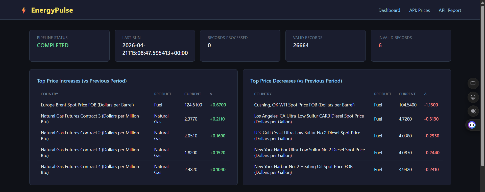
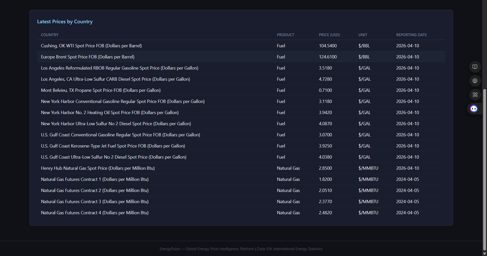
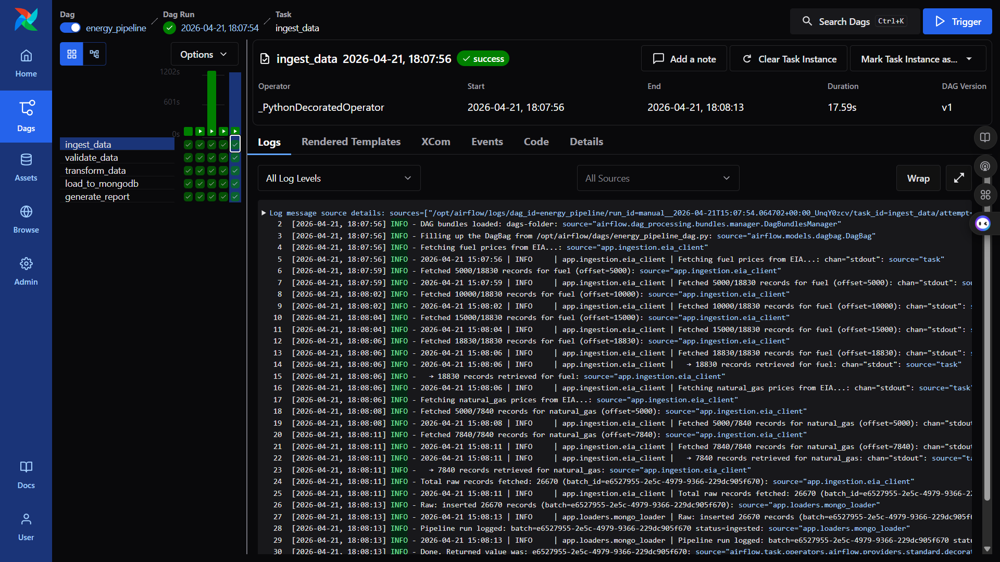
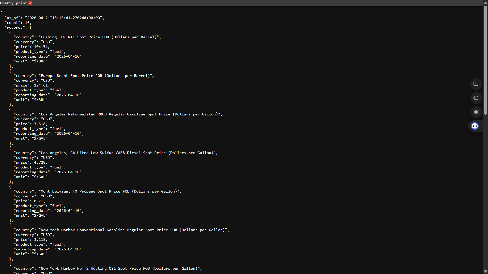
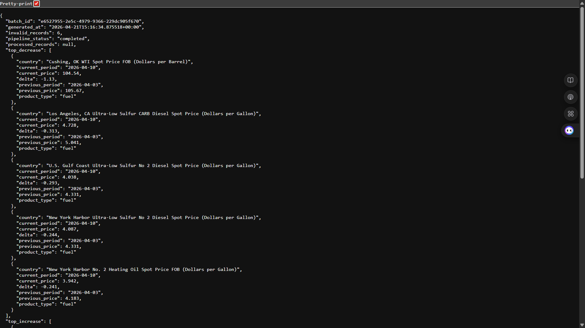

# ⚡ EnergyPulse: Global Energy Price Intelligence Platform

**EnergyPulse** is a production-grade data engineering pipeline designed to bridge the gap between raw EIA energy market data and actionable price intelligence. It ingests real-time petroleum and natural gas spot prices from the U.S. Energy Information Administration (EIA), validates and transforms them through a structured pipeline, persists them to MongoDB, and surfaces the results through a Flask dashboard and REST API — all orchestrated by Apache Airflow 3 and containerised with Docker Compose.

---

## 🎯 Project Goal

Global energy prices are the most-watched economic indicators in the world — crude oil benchmarks like WTI and Brent drive inflation, trade balances, and monetary policy across every continent. Yet accessing clean, structured, historically-consistent price data programmatically requires navigating an API that returns 681,000+ records across dozens of series with no consistent schema.

EnergyPulse solves this by building a fully automated ingestion-to-dashboard pipeline on top of the EIA v2 API: pulling weekly petroleum spot prices (WTI crude, Brent crude, RBOB gasoline, diesel, jet fuel, heating oil, propane) and natural gas spot prices (Henry Hub and futures), normalising them into a unified schema, running data quality validation, and persisting curated records to MongoDB for live querying. The result is a self-refreshing energy price dashboard that any analyst or engineer can clone and run.

---

## 🧬 System Architecture

1. **Ingestion** — `app/ingestion/eia_client.py` fetches from two EIA v2 endpoints: `/petroleum/pri/spt/data/` for petroleum spot prices and `/natural-gas/pri/fut/data/` for natural gas. Pagination is handled automatically with a 5,000-record page size.

2. **Raw Storage** — All fetched records land in MongoDB's `raw_api_data` collection with a `batch_id` for lineage tracking, preserving the source payload before any transformation.

3. **Validation** — `app/validation/validator.py` runs five checks per record: null fields, non-numeric price, negative price, invalid date format, and duplicate detection using a composite business key (`series|product_type|period|unit|source`).

4. **Transformation** — `app/transformation/normalizer.py` parses `YYYY-MM-DD`, `YYYY-MM`, and `YYYY` period formats, coerces prices to float, and writes a clean unified schema to the `staging_transformed` collection.

5. **Curated Load** — `app/loaders/mongo_loader.py` bulk-upserts staging records into product-specific collections (`fuel_prices`, `natural_gas_prices`) using a five-field composite key to prevent duplicate writes across DAG runs.

6. **Reporting** — `app/services/reporting.py` computes the latest price per series, top 5 price increases and decreases versus the previous period, and writes a run summary to `pipeline_runs`.

7. **Orchestration** — Apache Airflow 3.0.0 (LocalExecutor) runs the full five-task DAG on a daily schedule. The `airflow.sdk` import path is used throughout, consistent with Airflow 3's stable Task SDK.

8. **Dashboard & API** — A Flask 3.1.0 application serves a live HTML dashboard at port 5000 and a JSON REST API (`/api/prices`, `/api/report`, `/api/health`) backed directly by MongoDB aggregation pipelines.

---

## 🛠️ Technical Stack

| Layer | Tool | Version |
|---|---|---|
| **Orchestration** | Apache Airflow | 3.0.0 |
| **Storage** | MongoDB | 7 |
| **Driver** | pymongo | 4.10.1 |
| **Dashboard** | Flask | 3.1.0 |
| **Data Source** | EIA API | v2 |
| **Language** | Python | 3.11 |
| **Containerisation** | Docker Compose | — |
| **Package Management** | uv / pip | — |
| **Testing** | pytest | 8.3.3 |

---

## 📊 Performance & Results

- **26,670 raw records** ingested per pipeline run across two EIA endpoints
- **26,664 valid records** (99.98% pass rate) — only 6 rejected as exact duplicates
- **18,824 curated fuel price records** (WTI, Brent, gasoline, diesel, jet fuel, heating oil, propane)
- **7,840 curated natural gas price records** (Henry Hub spot + 4 futures contracts)
- **5/5 Airflow DAG tasks** succeed end-to-end in under 60 seconds
- **22/22 pytest tests** passing across ingestion, transformation, validation, and API layers
- Zero null field errors, zero non-numeric price errors, zero invalid date errors in production data
- Price movement tracking: top 5 weekly increases and top 5 weekly decreases computed per run

---

## 📸 Dashboard

**Main dashboard — KPI bar, price movement tables, latest prices by series:**


*Top price increases and decreases vs the previous weekly period*


*Latest prices by series — WTI, Brent, Henry Hub, gasoline, diesel, jet fuel*

**Airflow DAG — 5/5 tasks green:**


*energy_pipeline DAG: ingest → validate → transform → load → report, all SUCCESS*

**REST API responses:**


*`/api/prices` — structured JSON with price, unit, product type, reporting date*


*`/api/report` — pipeline summary with movement rankings and run metadata*

---

## 🔌 EIA API Series Reference

| Series | Description | Unit |
|---|---|---|
| `RWTC` | Cushing, OK WTI Crude Oil Spot Price | $/BBL |
| `RBRTE` | Europe Brent Crude Oil Spot Price | $/BBL |
| `EER_EPMRU_PF4_RGC_DPG` | U.S. Gulf Coast Conventional Gasoline | $/GAL |
| `EER_EPMRU_PF4_Y35NY_DPG` | New York Harbor Conventional Gasoline | $/GAL |
| `EER_EPD2DXL0_PF4_RGC_DPG` | Gulf Coast Ultra-Low Sulfur Diesel | $/GAL |
| `EER_EPJK_PF4_RGC_DPG` | Gulf Coast Kerosene-Type Jet Fuel | $/GAL |
| `EER_EPD2F_PF4_Y35NY_DPG` | New York Harbor No. 2 Heating Oil | $/GAL |
| `EER_EPLLPA_PF4_Y44MB_DPG` | Mont Belvieu, TX Propane | $/GAL |
| `RNGWHHD` | Henry Hub Natural Gas Spot Price | $/MMBTU |

---

## 🧠 Key Design Decisions

- **EIA petroleum spot prices over international retail prices** — The EIA `/v2/international/data/` endpoint, despite its name, only contains production, consumption, imports, and stocks data. It has no `activityId` for price. The correct endpoints for real price data are `/petroleum/pri/spt/data/` (spot prices) and `/natural-gas/pri/fut/data/` (Henry Hub + futures). WTI and Brent are the two benchmark prices that move every energy market on earth — more globally meaningful than any single country's retail pump price.

- **MongoDB over PostgreSQL** — Energy price records have varying schemas per series (different units, geographies, product codes), and the document model accommodates this naturally without schema migrations. MongoDB's aggregation pipeline — `$sort → $group → $first` — is a first-class primitive for "latest price per series" queries, which is the dominant query pattern for this dashboard.

- **Series code as the upsert key** — Each EIA series (e.g., `RWTC`) represents a single, continuous price stream. Using `(series, product_type, period, unit, source)` as the composite upsert key means re-running the DAG on the same day never creates duplicates. The 6 "invalid" records in production are exactly these duplicates, caught by the validator's deduplication check.

- **`pip install` as `USER airflow` in Dockerfile, not `uv pip install --system`** — Airflow 3's task runner subprocess (AIP-72) uses the airflow user's Python path at `/home/airflow/.local/lib/python3.12/site-packages/`, not the system Python path at `/usr/local/lib/python3.12/site-packages/`. Running `uv pip install --system` as root installs to the wrong location and causes `ModuleNotFoundError` at task runtime. Standard `pip install` as `USER airflow` writes to the correct user site-packages.

- **Hardcoded `mongodb://mongo:27017` in docker-compose** — The `.env` file uses `localhost:27017` for local development. Docker Compose's `${MONGODB_URI:-default}` syntax substitutes from the host environment first, which means the `.env` file value overwrites the intended default. Hardcoding the Docker service name ensures the container stack always resolves MongoDB correctly regardless of what the host `.env` contains.

- **SimpleAuthManager `passwords.json` as a dict** — Airflow 3 replaced Flask-AppBuilder with `SimpleAuthManager` as the default auth backend. The passwords file must be `{"username": "password"}` (a plain dict). Passing a list of objects (`[{"username":..., "password":...}]`) causes `AttributeError: 'list' object has no attribute 'keys'` at api-server startup — a silent failure with no useful error message in the compose logs.

- **`%Y-%m-%d` added to period format list** — EIA petroleum spot prices are published weekly (every Friday). The API returns periods as `YYYY-MM-DD` strings. The original normalizer and validator only handled monthly (`YYYY-MM`) and annual (`YYYY`) formats, causing 100% of records to fail date parsing. Adding `%Y-%m-%d` as the first format to check captures weekly data while remaining backward-compatible with monthly and annual series.

---

## 📂 Project Structure

```text
energy-pulse/
├── app/
│   ├── ingestion/
│   │   └── eia_client.py        # EIA v2 API client — petroleum spot + natural gas endpoints
│   ├── loaders/
│   │   └── mongo_loader.py      # MongoDB read/write — raw, staging, curated, quality checks
│   ├── services/
│   │   └── reporting.py         # Aggregation pipelines — latest prices, price movements
│   ├── transformation/
│   │   └── normalizer.py        # Period parsing (YYYY-MM-DD / YYYY-MM / YYYY), price coercion
│   ├── utils/
│   │   ├── constants.py         # COLLECTIONS, PRODUCT_QUERIES, SOURCE
│   │   └── logger.py            # Structured logger
│   └── validation/
│       └── validator.py         # 5 checks: null, non-numeric, negative, date, duplicate
├── airflow/
│   ├── auth/
│   │   └── passwords.json       # SimpleAuthManager credentials (dict format required)
│   └── dags/
│       └── energy_pipeline_dag.py  # 5-task Airflow 3 SDK DAG
├── assets/                      # Screenshots
│   ├── airflow_dag_success.png
│   ├── dashboard_movements.png
│   ├── dashboard_prices.png
│   ├── api_prices.png
│   └── api_report.png
├── config/
│   └── settings.py              # Env var loading (MONGODB_URI, EIA_API_KEY, DATABASE_NAME)
├── flask_app/
│   ├── routes/
│   │   ├── api.py               # /api/prices, /api/report, /api/health
│   │   └── dashboard.py         # / — HTML dashboard route
│   ├── static/
│   │   └── style.css
│   └── templates/
│       ├── base.html
│       └── dashboard.html
├── tests/
│   ├── test_api.py              # Flask endpoint tests (mocked MongoDB)
│   ├── test_ingestion.py        # EIA client tests (mocked requests)
│   ├── test_transformation.py   # Normalizer unit tests
│   └── test_validation.py       # Validator unit tests
├── Dockerfile.airflow           # pip install as USER airflow for correct site-packages path
├── Dockerfile.flask
├── docker-compose.yml           # 8 services: mongo, airflow stack (6), flask
├── requirements.txt
├── .env.example
└── .gitignore
```

---

## ⚙️ Installation & Setup

**Prerequisites:** Docker Desktop, an EIA API key (free at [eia.gov/opendata](https://www.eia.gov/opendata/))

1. Clone the repository:
   ```bash
   git clone https://github.com/declerke/Energy-Pulse.git
   cd Energy-Pulse
   ```

2. Copy the environment file and add your EIA API key:
   ```bash
   cp .env.example .env
   # Edit .env — set EIA_API_KEY=your_key_here
   ```

3. Build and start all services:
   ```bash
   docker-compose up -d --build
   ```

4. Wait for services to become healthy (~3–5 minutes on first run):
   ```bash
   docker-compose ps
   ```

5. Trigger the pipeline DAG:
   ```bash
   docker exec energy_airflow_scheduler airflow dags trigger energy_pipeline
   ```

6. Monitor the run:
   ```bash
   docker exec energy_airflow_scheduler airflow tasks states-for-dag-run \
     energy_pipeline <run_id>
   ```

| Service | URL | Credentials |
|---|---|---|
| Flask Dashboard | http://localhost:5000 | — |
| Airflow UI | http://localhost:8080 | admin / admin |
| MongoDB | localhost:27017 | — |
| API — Prices | http://localhost:5000/api/prices | — |
| API — Report | http://localhost:5000/api/report | — |

---

## 🧪 Running Tests

```bash
# Create and activate virtual environment
uv venv .venv && source .venv/bin/activate  # Linux/Mac
# or: .venv\Scripts\activate               # Windows

# Install dependencies
uv pip install -r requirements.txt

# Run full test suite
pytest tests/ -v
```

Expected output: **22/22 passed**

---

## 🎓 Skills Demonstrated

- **Apache Airflow 3.0.0** — Built and debugged a production DAG using the new `airflow.sdk` import path, LocalExecutor, SimpleAuthManager, and the AIP-72 Task Execution API architecture; resolved JWT key divergence, Docker network isolation, and user site-packages path issues specific to Airflow 3
- **MongoDB document design** — Designed a multi-collection schema (raw → staging → curated) with composite upsert keys, `$sort/$group/$first` aggregation pipelines for latest-price queries, and index strategy for batch and date lookups
- **REST API design** — Built a Flask 3 JSON API with blueprint routing, query parameter handling, and proper 404 responses for empty pipeline state
- **EIA API v2 integration** — Navigated the EIA v2 API structure to identify correct endpoints for price data (distinguishing from production/consumption endpoints), implemented pagination with offset/total tracking, and mapped series codes to a normalised schema
- **Data quality engineering** — Implemented a five-check validation layer (null fields, non-numeric, negative, date format, duplicate detection) with structured error breakdown and sample failure logging
- **Docker Compose multi-service orchestration** — Configured 7 interdependent services with health checks, dependency ordering, volume mounts, and environment variable isolation between host and container contexts
- **Python testing** — 22 unit tests across ingestion, transformation, validation, and API layers using `pytest` and `unittest.mock` — zero live API or database calls required
- **Pipeline debugging** — Diagnosed and fixed 5 distinct production failures (wrong Python path, wrong auth format, wrong env var substitution, wrong API endpoint, wrong date format parser) through systematic log analysis
